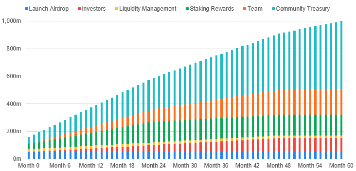

# EPI Tokenomics 

## EPI Allocation (Illustrative, TBD)

| Name | % Total | EPI Tokens |
| ---- | ---- | ----------- |
| `Pre-Launch Airdrop` | 5.0% | E50,000,000 |
| `Investors` | 10.0% | E100,000,000 |
| `Liquidity Management` | 2.0% | E20,000,000 |
| `Staking Rewards` | 15.0% | E150,000,000 |
| `Team` | 18.0% | E180,000,000 |
| `Community Treasury` | 50.0% | E500,000,000 |
| **`Total`** | **100%** | **E1,000,000,000** |

 

## EPI Release Schedule

